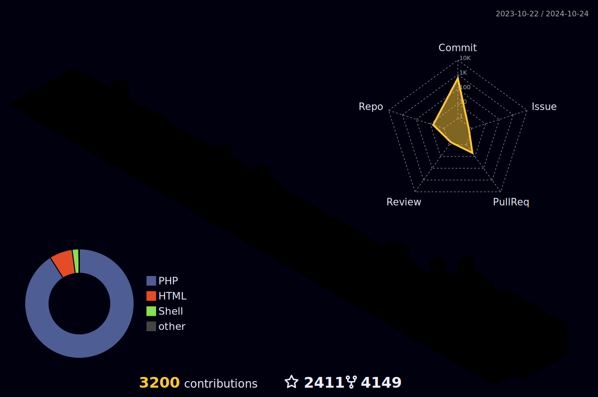

### Hi, I'm YeBeKhe! 👋

### Welcome to my  GitHub Profile
<!--
**YeBeKhe/YeBeKhe** is a ✨ _special_ ✨ repository because its `README.md` (this file) appears on your GitHub profile.

Here are some ideas to get you started:
-->

## ⚡ Tec Stacks

  

## 🌎 Find me

